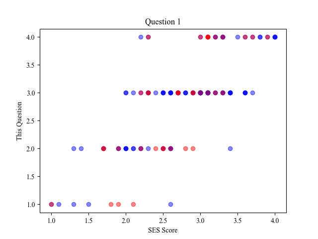

# self-esteem-stat

Part of my hw research paper of English Reading and Writing in 2021 Fall. The credit goes to the whole group of four students.

The code is not well-written. It is used only once.

With the help of `scipy.stats.kendalltau`, `pandas`, `matplotlib.pyplot`, this code analyzes data from wenjuanxing. The questionaire contains a complete Rosenberg Self-Esteem Scale and investigates a few other questions about students' behaviors. The code calculates the relevance / correlation between every single question and their SES score, among female, male and all students.

It is strange to write a research paper in English when you work with everyone else in Chinese. The paper may or may not be uploaded when it is completed.

